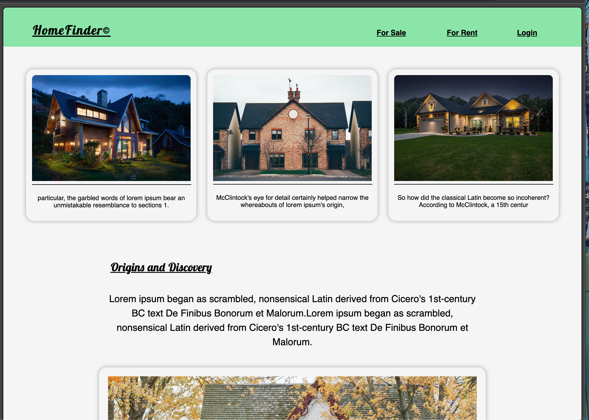
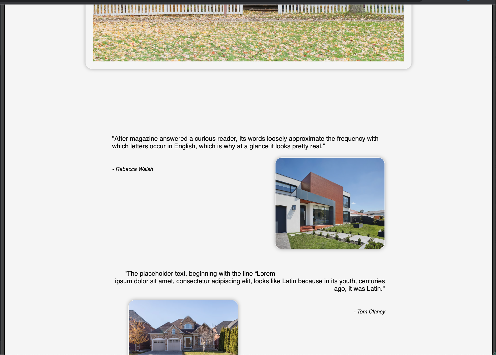
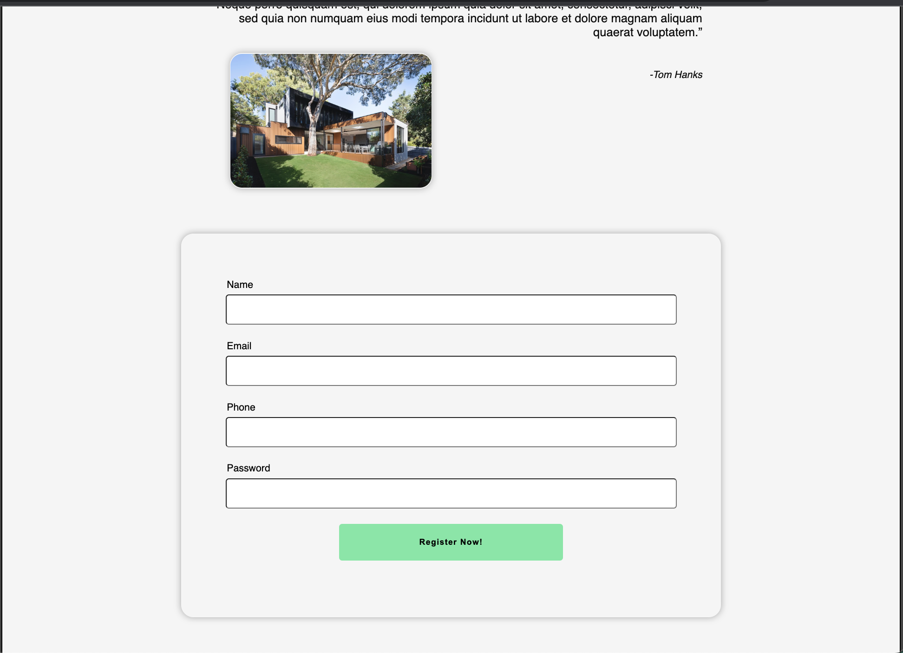
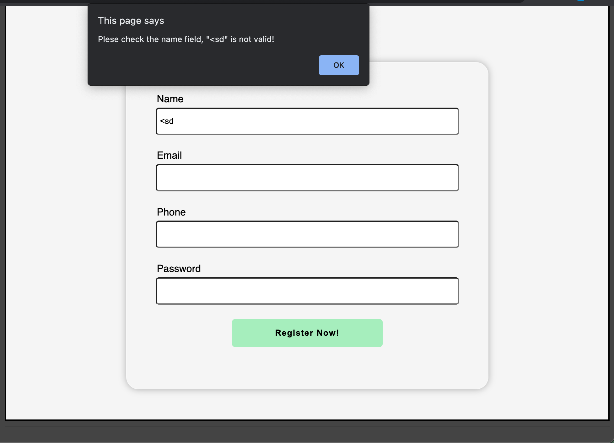

# HomeFinder

## Team Leader - Ruchita 

### Run Locally:
- install node, npm and mongodb on your local machine
- terminal command: "mongo"
- mongodb shell command: "use webpro" && "db.createCollection('clients')"
- clone git repository
- in the main directory terminal command: "npm install" && 
    "node ./backend/backend.js"
- open ./home/index.html in your preferred browser

=======
## Team Leader - Ruchitha 

### Khalfani's Agenda
- ~~Milestone 1: Home / Page User Registration  ( 24 July )~~ https://youtu.be/ZJ5ZxQX_Iyg
- ~~Pretty up desgin to homepage/registration~~

- ~~Form validation in the user registration~~

- ~~YouTube Video~~ 
https://youtu.be/K7bHHOAbU0k 

### Ruchita's Agenda
- ~~Milestone 2: User login~~
- ~~Milestone 3: Sellers Dashboard~~
- ~~PowerPoint (28 July)~~

### SCRUM :
- Saturday: 8PM
- Monday: 8PM
- Weds: 8PM
- Friday: 8PM

SATURDAY: SUBMIT PROJECT
